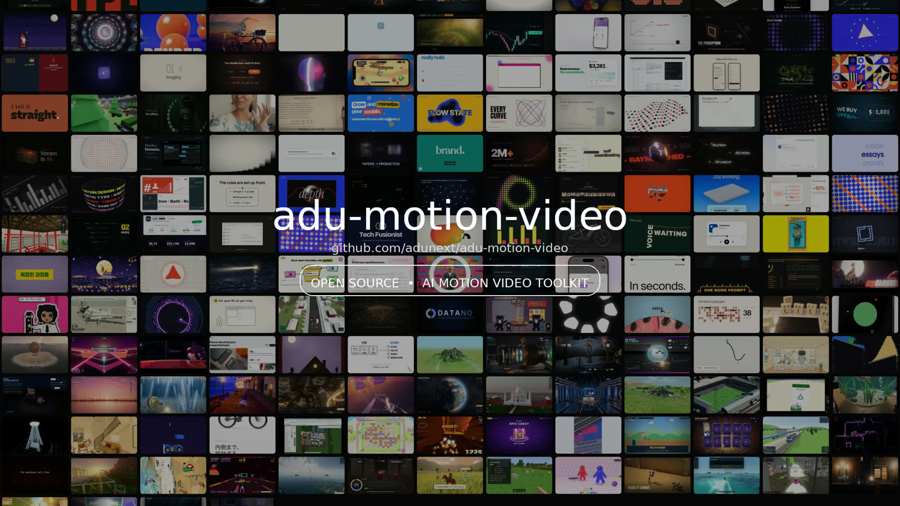
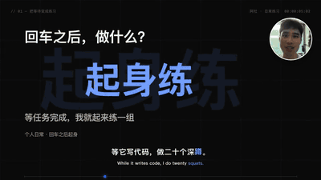
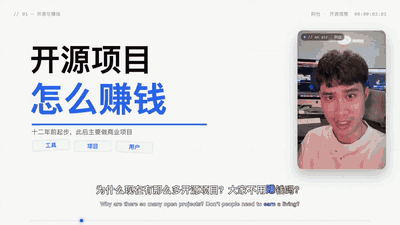
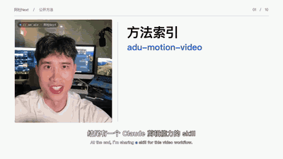
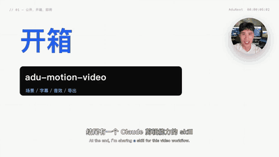
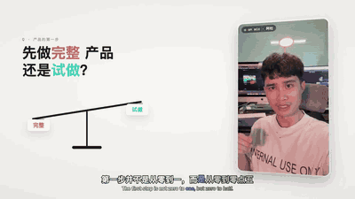
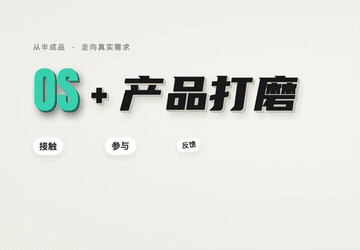
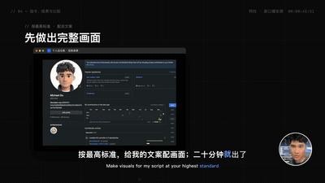
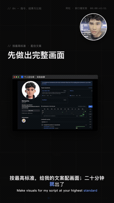
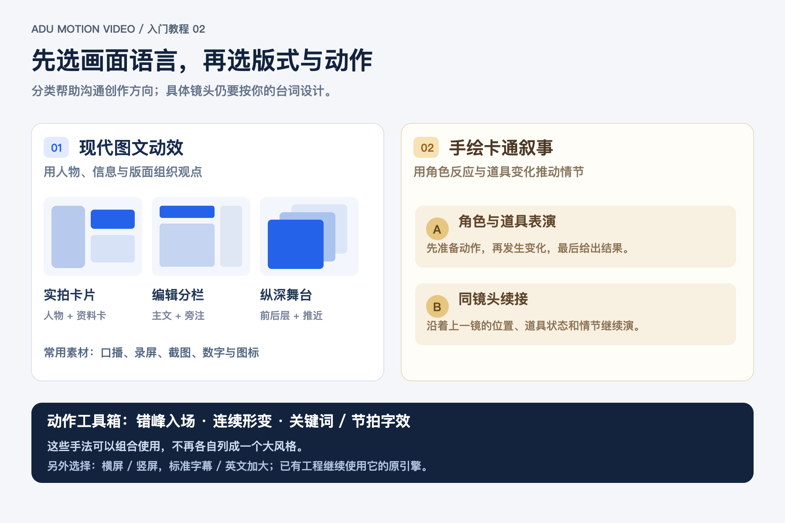

<p align="center">
  
</p>

# Adu-motion-video

**阿杜开源的高质量动画动效模板 Skill。选好模板和风格，把口播与素材交给 AI，就能开始剪辑。**

**阿杜实验室** · [www.adunext.com](https://www.adunext.com)

Adu-motion-video（简称 **adumotion**）提供经过阿杜与 Opus 5.5 筛选、制作的完整动画模板。场景、动作、转场和音效已经做好，AI 按你的口播、文案和素材制作新视频，交付 **MP4 与可编辑工程**。

**支持：Codex · Claude Code**　｜　豆包、WorkBuddy 的支持在后续计划中。

[浏览模板](#模板库)　·　[开始使用](#开始使用)　·　[适用场景](#适用场景)　·　[模板特点](#模板特点)　·　[技术资料](#技术资料)

---

## 模板库

先选一级模板，再从一行预览中选择风格。**已发布 2 类模板 · 7 种风格 · 17 个镜头组**；深色 3D 为新增候选，待声画确认。

点击动图查看 MP4，使用时告诉 AI 图下的完整编号，例如 **01-B**。[查看完整目录与素材要求 →](references/template-catalog.md)

### 模板 01 · 现代图文口播

> **已发布**　｜　5 种风格 · 14 个镜头组

**适用：** 真人讲解、知识拆解、工具演示。<br>
**准备：** 口播、文案，以及自己的演示录屏或证据视频。

<table>
  <tr>
    <td align="center" width="144"><a href="assets/demos/01-A.mp4?raw=true"></a><br><strong>01-A</strong><br><sub>原片节奏</sub></td>
    <td align="center" width="144"><a href="assets/demos/01-B.mp4?raw=true"></a><br><strong>01-B</strong><br><sub>连续形变</sub></td>
    <td align="center" width="144"><a href="assets/demos/01-C.mp4?raw=true"></a><br><strong>01-C</strong><br><sub>纵深舞台</sub></td>
    <td align="center" width="144"><a href="assets/demos/01-D.mp4?raw=true"></a><br><strong>01-D</strong><br><sub>杂志分屏</sub></td>
    <td align="center" width="144"><a href="assets/demos/01-E.mp4?raw=true"></a><br><strong>01-E</strong><br><sub>节拍字效</sub></td>
  </tr>
</table>

---

### 模板 02 · 纸面透视讲解

> **已发布**　｜　2 种风格 · 3 个镜头组

**适用：** 两难选择、抽象观点、资料聚合与行动交付。<br>
**准备：** 口播、文案，以及所选风格需要的插图或指定字体。

<table>
  <tr>
    <td align="center" width="144"><a href="assets/demos/02-A.mp4?raw=true"></a><br><strong>02-A</strong><br><sub>纸面天平</sub></td>
    <td align="center" width="144"><a href="assets/demos/02-B.mp4?raw=true"></a><br><strong>02-B</strong><br><sub>纸面聚合</sub></td>
  </tr>
</table>

---

### 模板 03 · 深色 3D

> **待声画确认**　｜　9 场完整编舞 · 横屏 / 原生竖屏

暗色舞台、立体窗口、镜头推进与多屏展陈。已制作不同内容的完整九场样片，并补齐 HDR 转 SDR 色彩处理。

**适用：** 产品演示、工具评测、作品集。<br>
**准备：** 口播，以及所选场景需要的作品、比较视频或软件录屏。[查看模板说明 →](references/dark-3d-template.md)

<table>
  <tr>
    <td align="center" width="144"><a href="assets/demos/03-A.mp4?raw=true"></a><br><strong>03-A · 横屏</strong><br><sub>多屏展陈</sub></td>
    <td align="center" width="144"><a href="assets/demos/03-A-portrait.mp4?raw=true"></a><br><strong>03-A · 竖屏</strong><br><sub>多屏展陈</sub></td>
  </tr>
</table>

动图均为 **8 秒静音预览**。样片来源、声音与具体发布范围见下方说明。

<details>
<summary>展开预览说明与已发布范围</summary>

02-B 为排除人物、字幕、账号角标和声音的开箱交付局部，其它已有 MP4 demo 含声音。01-A、01-B、02-A 展示的是已发布模板制作的新内容；01-C、01-D、01-E 展示原工程的风格短段，其三个组已完成各自新内容整片与独立使用验收，并随 3.2.0 发布；预览不代表来源的所有演出已进入稳定库。

3.3.0 新增的 [02-B · 纸面聚合](packs/paper-ball-performance/1.0.0/README.md) 只覆盖两个已验收镜头组；完整源工程的其它 32 场保持原状态。新稿的六卡、七页与十卡属于固定示意编舞，须按本期意义填写。更多模板与风格持续更新。

03-A 展示不同内容九场样片的横屏与原生竖屏软件窗口段，仅包含所有者口播与本人录屏，公开预览无声。完整样片各 108.4 秒；此前 1.1.0 的冷安装、声音与时钟记录保留；1.1.1 重出色彩修正版，最终连续声画仍待作者确认。当前为候选版本，不计入十七个稳定组。1.1.1 修复 HLG 素材直抽 JPEG 的偏色，导出校验 SDR 色彩范围与 BT.709 标记。完整私人影片和第三方作品不作为模板输入分发。

</details>

---

## 开始使用

| 步骤 | 要做什么 |
| --- | --- |
| **1 · 添加 Skill** | 在 Codex 或 Claude Code 中安装本仓库，也可以让 AI 帮你添加 |
| **2 · 准备素材** | 提供剪好的口播、文案和对应录屏、图片；有字幕文件也一起提供 |
| **3 · 选择模板** | 报出完整编号，并说明素材位置和输出目录 |

### 添加 Skill

把这段话发给 AI：

```text
请添加 adu-motion-video Skill：
https://github.com/adunext/adu-motion-video
安装后确认能找到这个 Skill，并检查制作视频需要的环境。
```

### 制作视频

把编号和素材目录换成自己的：

```text
使用 adu-motion-video，选模板 01 的 B 风格（01-B · 连续形变），
帮我剪辑这条口播。

口播、文案、字幕和录屏都在：/我的素材目录
请按我的内容安排动画，输出 MP4 和可编辑工程到：/我的输出目录
```

需要小图标或动画素材时，也可以加一句：**“从阿杜导演的动画素材 API 中挑选合适的素材。”** 真人、产品画面和实际操作录屏仍由你提供。

---

## 适用场景

| 场景 | 可以怎么用 |
| --- | --- |
| **口播视频** | 为真人讲解加重点、图解、动画和字幕 |
| **知识讲解 / 科普** | 把抽象概念、关系和步骤讲清楚 |
| **AI 工具 / 软件教程** | 用录屏配合动画，突出操作与实际效果 |
| **产品介绍 / 功能演示** | 展示卖点、使用流程和前后变化 |
| **观点解读 / 方法分享** | 用对比、拆解、归纳和行动步骤组织内容 |

---

## 模板特点

| 特点 | 说明 |
| --- | --- |
| **模板级开源，Token 消耗低** | 完整动画已经做好，AI 主要处理文案、素材和时间安排，减少从零编写动画与反复试错的消耗 |
| **输出更稳定** | 复用检查过的动作与转场，便于同一系列保持一致的质量 |
| **阿杜逐个精选，持续更新** | 阿杜每天筛选新的高质量动画，和 Opus 5.5 一起制作更多模板与风格 |
| **自带动画素材来源** | 阿杜导演公开素材 API 提供精选整理的 **11,028 个 Lottie 动画**，无需 API Key，可用于图标、点缀与辅助讲解。[查看动画目录 →](https://adudir.com/api/lottie-catalog/manifest) |
| **成片与工程都交给你** | 导出 MP4 后仍能修改文字、素材和动画，继续做下一版 |

素材 API 后续计划支持按需生成图片、动画等素材；当前开放的是现有动画的查询与下载。

---

## 技术资料

<details>
<summary><strong>展开模板版本、素材 API 与安装制作说明</strong></summary>

以下内容供需要安装命令、接口调用、模板版本和开发细节的用户查阅。

**3.3.1** 补齐素材导入的 HDR → SDR 转换与标准 SDR 导出色彩校验，03-A 采用 1.1.1 色彩修正候选。已有十七组和旧候选的冻结字节保持不变。

**3.3.0** 保留 3.2.0 的十五组，并增加纸面聚合两个组。此前稳定范围为 A「原片节奏」三个组、B「连续形变」两个组、C「舞台镜头」/D「杂志分屏」/E「节拍字效」各三个组，以及试点外来源的纸面透视续接组，限 macOS、横屏 1080p60。五条路线的源演出与对应新内容已经作者确认；B/C/D/E 的完整新片由未参与提炼的执行者从冻结公开包和本期输入独立制作。每条路线保留自己的运动、人物与声音，通过命名语义字段绑定新内容。逐组范围与限制见[能力与验收矩阵](docs/capability-matrix.md)。B 的计划干扰组与旧候选原字节保留；旧 `anim3/anim4` 的 21 个宏场景仍为 experimental，9 个基础 `TPL` 为 quick-start。

### 模板编号与实际版本

编号表示“一级模板－二级风格”，不随话题或案例名称变化。AI 遇到编号时，先查[模板与风格目录](references/template-catalog.md)，再读取相应包；已发布模板的具体镜头范围见[能力与验收矩阵](docs/capability-matrix.md)。

| 编号 | 实际包版本 | 状态 |
| --- | --- | --- |
| 01-A | `classic-performance@1.0.0` | 已发布 |
| 01-B | `continuous-performance@1.0.0` | 已发布 |
| 01-C | `stage-performance@1.0.0` | 已发布；三个完整组 |
| 01-D | `editorial-performance@1.0.0` | 已发布；三个完整组 |
| 01-E | `kinetic-performance@1.0.0` | 已发布；三个完整组 |
| 02-A | `paper-balance@1.0.0` | 已发布；一个段落镜头组 |
| 02-B | `paper-ball-performance@1.0.0` | 3.3.0；两个完整镜头组 |
| 03-A | `anim4-showcase-macro@1.1.1-candidate` | 待声画确认；九场，横屏与原生竖屏 |

3.3.0 共七个风格中的十七个稳定完整镜头组。02-B 的源/重放对照与 18.2667 秒新内容已获作者确认，严格栅格审计的 1 issue/2 warning 和复查结果仍保留；此增量不声称完整新路线或新独立作者验证。完整实测范围为 macOS、横屏 1920×1080、60fps。竖屏需重新布局，其它系统与字体组合需另行验证。新稿要留足动作与读字时间；实际 Token 消耗随素材处理、片长和修改量变化，尚无统一量化基准。

### 公开动画素材 API

- 动画目录：`GET https://adudir.com/api/lottie-catalog/manifest`
- 动画说明：`GET https://adudir.com/api/lottie-catalog/annotations`
- 下载单个动画：`GET https://adudir.com/api/lottie-catalog/file/{preset}.json`

**无需登录或 API Key。** 截至 2026-10-01，线上目录返回 `total: 11028`；目录、注解和单文件下载均已实测。先查目录与注解，再按返回的 `preset` 下载需要的 JSON，保存到本期工程的素材目录。获取方法和使用边界见[动画素材 API](references/lottie-assets.md)。

**请求额度：每个 IP 每天 20 次，全接口每天合计 2,000 次，北京时间零点重置。** 查询目录、注解和下载素材共用额度，请缓存后按需使用。超额返回 `429`；每日额度用完时按 `Retry-After` 等待，避免反复重试。

```bash
# 查询目录；避免每条视频都重新拉全库
curl -fsS https://adudir.com/api/lottie-catalog/manifest -o lottie-manifest.json

# 示例：下载一个已核实存在的加载动画
curl -fsS https://adudir.com/api/lottie-catalog/file/insider_loading.json -o insider_loading.json
```

素材 API 提供可用动画文件；各模板仍按自己的素材与渲染要求接入。生成素材接口尚未开放。第三方动画沿用各自原始许可，仓库 MIT 许可不替代素材许可。

<details>
<summary><strong>展开安装、制作命令与验收说明</strong></summary>

### 先准备什么

- 一条已经剪好、长度确定的口播视频，以及对应文案；带时间码的字幕（SRT）有助于绑定动作，关键字最好有逐词时间。
- 本期要展示的录屏、图片、头像、标识、作品视频和可用配乐。公开 demo 仅供观看，不提供可复用的原始真人或第三方素材。选用需要这些素材的场景时，必须提供本期有权使用的素材。
- 期望的画幅、账号名、字幕语言和交付目录。稳定组按 **1920×1080、60fps** 制作；03-A 候选另提供 **1080×1920、60fps** 原生布局。其它组的竖屏需另做布局，不能直接裁切。
- 本机 Node.js 18+、FFmpeg 9+ / ffprobe、Chrome，以及可运行本地命令的 Agent。当前稳定组合在 macOS / CPython 3.14.7 / 1080p60 验证，Python 包固定在 requirements-runtime.txt；其它平台、字体与 Python 组合需单独验证。

最终可得到一个可再编辑的项目目录、带音乐与音效的 MP4，以及帧数、解码和响度检查结果。画面质量仍须观看完整成片并与原工程关键动作对照；命令通过不等于视觉验收通过。

### 选择制作路线

| 路线 | 内容与用途 | 当前边界 |
| --- | --- | --- |
| [A 原片节奏](packs/classic-performance/1.0.0/README.md) | 主张与人物、真实证据聚焦、三项分解归纳 | Stable；三个组，已验收的 macOS 1080p60 |
| [B 连续形变](packs/continuous-performance/1.0.0/README.md) | 同一容器改变角色、拆解与闭合 | Stable；两个组，计划干扰组仍为 candidate |
| [C 舞台镜头](packs/stage-performance/1.0.0/README.md) | 前中后层、人物让位、实际证据与概念归纳 | Stable；三个组，完整新片与独立使用已确认 |
| [D 杂志分屏](packs/editorial-performance/1.0.0/README.md) | 版心、人物与证据分栏、跨栏交接 | Stable；三个组，本期新片按用户要求无背景配乐 |
| [E 节拍字效](packs/kinetic-performance/1.0.0/README.md) | 整词推动实体、撞击回稳、四项收拢 | Stable；三个组，完整新片与独立使用已确认 |
| [纸面透视组](packs/paper-balance/1.0.0/README.md) | 疑问、天平、用途、批注与三步确认 | Stable；一个续接组，保留约 0.37 秒的源入场 |
| [纸面聚合组](packs/paper-ball-performance/1.0.0/README.md) | 六类资料聚合成网络；日历、能力、开箱与交付 | Stable；两个组，标题字体为显式用户输入，原声不变速 |
| [完整场景包 `anim3`](packs/anim3/README.md) | 12 个连续编辑卡片场景，保留人物、道具、数字、镜头、转场与原场景音效编舞 | 实验性；新文案与素材需逐场绑定和验收 |
| [03-A 深色 3D · 多屏展陈](references/dark-3d-template.md) | 保留 9 个完整场景，新增原生竖屏；作品墙、九宫格、软件窗口与赛道 | Candidate / 待声画确认；完整新内容与冷安装证据见验证记录 |
| [基础 `TPL`](references/templates.md) | 9 个短场景函数，用于快速原型或从零组合较轻的片段 | Quick-start；不代表上述原工程的全部动画 |
| [手绘卡通叙事](references/handdrawn-animation.md) | 角色与道具表演、同镜头续接的方法 | 目前是制作方法和既有示例，尚未提取为完整场景包 |

`anim3`、`anim4` 是工程包 ID，不是用户视频标题或两种固定品牌风格。完整场景包可挑选、重排、重复场景，但必须尊重动作顺序、素材含义和片长。短到容不下原动作的片段会拒绝构建；多出的时间优先给可停留的画面，不会把所有动画整段慢放。作品墙需要先把至少 27 个真实独立作品制备为 389 张展示精灵，并如实保留独立作品数；不能直接拿 27 张精灵输入构建器。指定模板后，素材目录中的其他现成工程不会自动成为动画底稿。跨包逐场组合目前需要额外编排，见[来源与多包编排](references/full-project-templating.md#来源与多包编排)。详见[完整工程复用与验收](references/full-project-templating.md)。



### 用 Codex 或 Claude Code 开始

```bash
# 任选与你的 Agent 对应的位置；也可以克隆到其他路径并让 Agent 读取 SKILL.md
git clone https://github.com/adunext/adu-motion-video.git ~/.claude/skills/adu-motion-video
# Codex 可用：git clone https://github.com/adunext/adu-motion-video.git ~/.codex/skills/adu-motion-video

PL="$HOME/.claude/skills/adu-motion-video/scripts/pipeline.sh"
# 若装在 Codex 目录：PL="$HOME/.codex/skills/adu-motion-video/scripts/pipeline.sh"
bash "$PL" doctor
bash "$PL" setup
```

让 Agent 先阅读 [SKILL.md](SKILL.md)、[制作约定](references/rules.md) 和所选包说明。先发现包，选显式版本；以下以稳定的 A 包为例：

```bash
bash "$PL" packs
bash "$PL" macro-spec classic-performance@1.0.0 /已有目录/本期配置.json
# 编辑配置：挑场景、填账号及每场文案/数字/素材路径、绑定关键台词时间
bash "$PL" macro-build classic-performance@1.0.0 /已有目录/本期配置.json /已有目录/剪好口播.mp4 /已有目录/新工程
bash "$PL" stills /已有目录/新工程 0,4,12
bash "$PL" audio /已有目录/新工程
bash "$PL" mix /已有目录/新工程
bash "$PL" render /已有目录/新工程 /已有目录/新片_v1_16x9_60fps.mp4
bash "$PL" check /已有目录/新片_v1_16x9_60fps.mp4
```

以上路径只是格式示例，`macro-spec` 输出和新工程路径必须事先不存在。可传 `--subs-js /路径/新口播字幕.js` 给 `macro-build`；字幕必须与新口播对齐。`macro-spec` 列出所选包的全部组，使用前删去不需要的组，按新口播顺序排列，并补齐必填输入。配置还可指定本期音乐 `music:{mode:"track",path,offset}`，以及本期混音增益 `mix:{musicVolume:0.42}`；完成后会把实际选择、处理图和声音摘要保存为 `mix_recipe.json`，详见[声音与重现](references/audio.md)。`anim4` 和 `anim3/s06` 默认在 macOS 使用 Vision 跟踪新口播人脸，其他系统要显式提供审核过的固定裁切。构建器要求目标场景总帧数与剪好口播相符，按输出帧网格量化后必须完全一致。长短差异和动作锚点的处理见[完整工程复用与验收](references/full-project-templating.md)。

可以直接对 Agent 说：

> 使用 adu-motion-video 的完整场景包制作这条新口播。口播、SRT、文案和本期录屏在 `/实际路径/素材目录`。先运行 packs，按语义选择显式版本的完整镜头组或场景，列出所需替代素材和关键台词时间，补齐配置后生成工程；检查首帧、转场、文字裁切、口型、音乐和音效，再导出新 MP4。不要把原工程的示例文字、数字或第三方素材带进新片。

Agent 缺少 Skill 机制时，先读 [AGENTS.md](AGENTS.md)。基础模板只需运行 `bash "$PL" demo /不存在的新目录` 查看 36 秒示例；参数见[模板目录](references/templates.md)。

### 验收与扩展

至少检查第一帧有人物时人物是否可见、所有关键动作前后帧、最长文案的字体与安全区、录屏和图片裁切、场景交接、全段口型、字幕、音乐层次、音效位置及片尾。再与原工程的对应动作连续播放对照。任何一项未完成，只能标记为 experimental 或局部通过，不能宣称完整复刻验收通过。[教程：检查连续动作](assets/tutorials/03-continuity.png) · [验证记录](docs/validation.md)。

已完成的新 Opus 工程可按[持续模板接入](references/template-intake.md)登记与冻结。按新增价值区分案例、预设、变体、镜头组、路线与引擎；接收、候选和稳定发布各有证据状态。包 ID/版本和运行代码固定在新工程，后续升级不会自动改变旧片。候选提炼保留完整因果、人物、进退与声音，经过新内容及独立使用再扩大稳定库。仓库结构与贡献要求见[完整工程复用与验收](references/full-project-templating.md)。

MIT License · 第三方说明见 [THIRD_PARTY.md](THIRD_PARTY.md)。

</details>

</details>

[阿杜实验室](https://www.adunext.com) · [AI 执行入口](SKILL.md) · [模板与风格目录](references/template-catalog.md) · [动画素材 API](references/lottie-assets.md) · [更新与下载](https://github.com/adunext/adu-motion-video/releases) · [MIT License](LICENSE) · [第三方说明](THIRD_PARTY.md)
