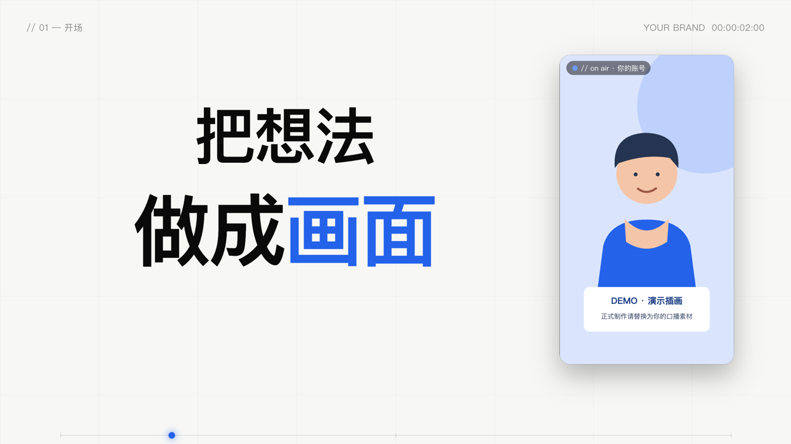
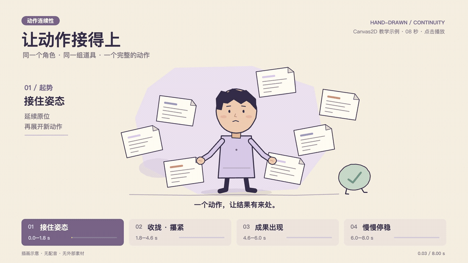

# adu-motion-video

**在 Codex 或 Claude Code 里，把你的口播、文案和素材做成可继续修改的视频工程，再导出 MP4。**

你用自然语言说明内容和修改意见，AI 负责编排场景、修改动画、对齐字幕和运行本地导出。这是给能读写文件、执行命令的 AI 编程工具使用的 Skill；普通网页聊天窗口无法直接运行这套本地流程。

> **大量模板整理上传中，敬请期待。**

| 先弄清这三件事 | 具体是什么 |
| --- | --- |
| **用什么工具** | Codex 桌面版 / CLI，或 Claude Code；本地还需要 Node.js 18+、Python 3.10+、FFmpeg 和 Chrome / Chromium。AI 工具负责创作，浏览器和 FFmpeg 负责渲染。 |
| **你提供什么** | 做口播：剪好的口播视频 + 对应文案，建议附 SRT；可选录屏、图片、Logo、音乐。改旧片：成片 + 可编辑工程 + 时间点和改法。先试用：不需要任何个人素材。 |
| **最后得到什么** | 一个独立版本的 MP4、可编辑 HTML / JavaScript 工程、关键画面预览和导出核验记录；有字幕/混音时保留相应数据与音轨。 |

只有文案也能先做**无配音动效样片**；完整口播需要你提供声音或另行使用配音工具。安装 Skill 不会自动拍摄真人，也不会把任意文案直接套成精修成片。


## 先跑通一条视频

### 1. 安装到你使用的 AI 工具

目标目录不能已经存在；已有安装先保留本地修改，再更新。以下命令使用 Bash，适用于 macOS / Linux；Windows 用户可在 WSL 中使用同一套工具和路径。当前完整实测环境是 macOS，Linux / WSL 尚未做端到端验证。

**Codex：**

```bash
mkdir -p "$HOME/.agents/skills"
git clone https://github.com/adunext/adu-motion-video.git "$HOME/.agents/skills/adu-motion-video"
```

**Claude Code：**

```bash
mkdir -p "$HOME/.claude/skills"
git clone https://github.com/adunext/adu-motion-video.git "$HOME/.claude/skills/adu-motion-video"
```

新开会话，让 AI 确认能找到 `adu-motion-video`。Codex 可输入 `$adu-motion-video`，Claude Code 可输入 `/adu-motion-video`，也可以直接说“使用 adu-motion-video 制作视频”。安装位置参考 [Codex 官方文档](https://learn.chatgpt.com/docs/build-skills) 和 [Claude Code 官方文档](https://code.claude.com/docs/en/skills)。已有能正常识别的 `~/.codex/skills` 安装无需重复建立另一份。

### 2. 检查环境并准备依赖

先安装 [Node.js](https://nodejs.org/)、[Python](https://www.python.org/downloads/)、[FFmpeg](https://ffmpeg.org/download.html) 和 [Chrome](https://www.google.com/chrome/)。也可以把下面这段交给 AI：

```text
使用 adu-motion-video。先检查本机环境，列出缺少的工具并协助安装；
然后运行仓库自带的演示，输出到我指定的文件夹。
我还没有口播素材，请明确使用演示模式。
```

自己运行时，**以下命令都在你准备存放视频的工作文件夹里执行**。设置一次安装路径，后续命令沿用：

```bash
SKILL_DIR="$HOME/.agents/skills/adu-motion-video"  # Claude Code 改成 ~/.claude/skills/adu-motion-video
PL="$SKILL_DIR/scripts/pipeline.sh"
bash "$PL" doctor
bash "$PL" setup
bash "$PL" doctor
```

`doctor` 只检查。`setup` 安装 Skill 的 Node/Python 依赖，不替你安装系统工具或浏览器。找不到浏览器时可用 `CHROME="/你的浏览器可执行文件"` 指定。中文字体使用系统已安装字体；缺字时安装中文字体后重新检查画面。人脸追踪是可选步骤，目前仅支持 macOS。

### 3. 导出演示，确认这台机器能工作

```bash
bash "$PL" demo "$PWD/my-first-demo"
```

它会新建演示工程、生成合成配乐与音效，并导出 **18 秒、1920×1080、60fps** 的演示视频。画面中的人物是明确标注的演示插画，不是自动生成的真人口播。视频位于 `my-first-demo/demo.mp4`，工程和核验记录也在该目录；目录已存在时请换一个新名字。



想先看不含声音的最小例子：

```bash
node "$SKILL_DIR/scripts/render_project.mjs" \
  "$SKILL_DIR/examples/silent-demo.html" \
  --output "$PWD/motion-demo.mp4" --width 1920 --height 1080 --fps 60
```

这是 **6 秒静音演示**。两条路径都不需要作者的头像、录屏、视频或音乐。运行成功后，再把自己的素材接进来。

## 做你的第一条正式视频

把素材集中到一个文件夹，文件名可以不同，给 AI 准确路径即可：

```text
我的视频/
├── 口播.mp4            必需：已经剪好的口播，或改片时的原成片
├── 文案.txt            必需：对应口播的完整文字
├── 字幕.srt            建议：节省校对和分组时间
├── 素材/               可选：录屏、图片、Logo
├── 音乐.mp3            可选：有使用授权的背景音乐
└── 原工程/             改旧片时提供；新片不需要
```

**给 AI 的完整示例请求：**

```text
使用 adu-motion-video，制作我的第一条口播视频。
素材目录：/请替换为实际路径/我的视频
口播：口播.mp4；文案：文案.txt；字幕：字幕.srt。
选“现代图文动效 → 实拍卡片”，搭配连续形变和少量关键词字效。
画幅 16:9，60fps，中英双语字幕；账号名称用“我的账号”。
先检查素材和环境，按口播编排分镜，再做关键帧和短段检查，完成后导出新版本。
把 MP4、可编辑工程和核验记录放在这个素材目录下，不覆盖原文件。
```

如果已有工程，可以这样改：

```text
使用 adu-motion-video 修改 /实际路径/原工程，参考同目录的成片。
14 秒处补回我提供的漏句音频；画面继续上一镜人物和道具的动作，
不要突然换成新背景。沿用原工程引擎，输出独立新版本。
```

使用 `template/` 的现代图文方案时，AI 会新建工作工程，关闭演示模式，接入你的口播并重排时间轴；修改 `config.js` 的账号、品牌、时长和字幕，按新文案编写场景。**大类决定画面语言，具体镜头仍需创作**。SRT 缺失时可以协助整理；自动语音识别和配音并未内置，使用外部工具时应说明来源。

如果你想自己接入一条已经剪好的口播，可直接导入，无需再找原始素材：

```bash
bash "$PL" new "$PWD/my-video"
bash "$PL" import "$PWD/my-video" "/实际路径/口播.mp4"
```

导入会生成逐帧图片、`talkmap.js`、`voice.wav` 和 `import.json`，保留真实声音。接着让 AI 按 `import.json` 的时长设置 `config.js`（`demo: false`），重新安排场景、字幕和配乐，再预览导出。`import` 不会替你改文案或自动编排镜头。已有素材输出时会拒绝覆盖。

手动工作流及命令参数见 [工具说明](references/tooling.md)、[文案与时间轴](references/authoring.md)。网页直接打开默认显示静帧；通过 `?t=2.8` 查看指定时间，导出 MP4 查看完整运动。

## 怎么选风格

先选**大类**，再选该类下的**版式或表演方式**，最后搭配动作手法。原来的 A～F 已合并，不再把同一风格中的动作变化当成六种独立风格。

| 大类 | 下一级选择 | 适用内容 |
| --- | --- | --- |
| **现代图文动效** | 实拍卡片 | 真人讲解、工具演示、证据卡和数字对比 |
| | 编辑分栏 | 观点解读、步骤说明、人物与资料并排展示 |
| | 纵深舞台 | 主体突出、前后层次、镜头推近 |
| **手绘卡通叙事** | 角色与道具表演 | 用角色反应、道具变化表达抽象观点 |
| | 同镜头续接 | 补漏句、扩展动作，沿着原人物位置和情节继续演 |

**可组合的动作手法：**错峰入场、连续形变、关键词 / 节拍字效。字幕另选标准版或英文加大版；它们不是视觉风格。横竖屏也属于画幅选择，需要分别排版。


例如：“手绘卡通叙事 → 同镜头续接，让角色把多份草稿攥成一点成果。”或“现代图文动效 → 编辑分栏，字幕选英文加大”。详细动作关系见 [视觉分类](references/visual-routes.md)。

## 手绘动画怎样接得自然

本轮把真实改片中验证过的方法整理成了 [手绘动画与续接指南](references/handdrawn-animation.md)：保留人物、道具和相机的起始状态，编排“准备 → 主动作 → 结果 → 收势”，同时分开管理原片时间、最终成片时间和新增片段时间。

下面四幅图来自仓库自带的可运行示例，不需要任何个人素材：


```bash
node "$SKILL_DIR/scripts/render_project.mjs" \
  "$SKILL_DIR/examples/handdrawn-continuity.html" \
  --output "$PWD/handdrawn-demo.mp4" --width 1920 --height 1080 --fps 60
```



想将手绘方法用于自己的内容，可这样请求：

```text
使用 adu-motion-video，选择“手绘卡通叙事 → 角色与道具表演”。
我的旁白是 /实际路径/旁白.wav，文案是同目录的文案.txt。
参考 handdrawn-continuity.html 的动作衔接，在新工程中按我的文案重新设计镜头；
以我的真实声音安排片长、字幕和动作重音，先做关键帧和短段，再导出新 MP4。
不要改动 Skill 内的教学示例，也不要沿用示例的 8 秒时长。
```

Canvas 示例的画面和时钟都在自身 HTML 中，配音作为外部音轨合成；它不使用现代图文模板的 `demo` 开关。这个 **8 秒静音教学示例**使用 Canvas2D，方便直接运行和阅读。修改已有 p5.brush 工程时仍保留原引擎；指南说明了两者的接口差异，不能把它们的渲染入口直接互换。

## 哪些可以直接运行

| 资源 | 当前状态 |
| --- | --- |
| `demo` 新手演示 | 不需要个人素材，含合成配乐和音效 |
| [静音图文示例](examples/silent-demo.html) | 6 秒，可直接导出 |
| [手绘续接示例](examples/handdrawn-continuity.html) | 8 秒，可直接导出 |
| [字幕方案示例](examples/subtitle-options.html) | 6 秒，可检查标准 / 英文加大字幕 |
| `template/` | 可编辑起点；演示模式能运行，正式口播需要自己的媒体和场景编排 |
| [场景配方与历史源码](examples/README.md) | 供学习和迁移动作，不是带齐素材的一键成片模板 |

本轮验证记录见 [发布检查](docs/validation.md)，明确区分实测内容和未覆盖的平台。渲染会检查资源错误、帧数、时长和完整解码；仍需人工或 AI 看画面，确认字幕、人物裁切和转场。

## 继续阅读

- [SKILL.md](SKILL.md)：AI 的执行入口。
- [视觉分类](references/visual-routes.md)：大类、下级方案、动作手法。
- [字幕选项](references/subtitle-options.md)：标准中英字幕和英文加大。
- [手绘动画与续接](references/handdrawn-animation.md)：动作设计、时钟与原工程适配。
- [工具与排错](references/tooling.md)：导出、局部检查和浏览器配置。
- [源码与许可](THIRD_PARTY.md)：MIT 自有代码与第三方来源边界。

A local video-authoring skill for Codex and Claude Code. Bring your own script and media; receive an editable project, MP4 and verification record. Includes media-free runnable demos. Licensed under [MIT](LICENSE); external models, fonts and media retain their own terms.
