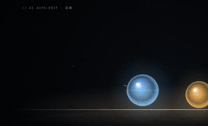
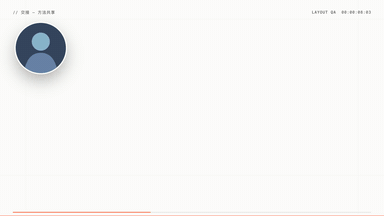
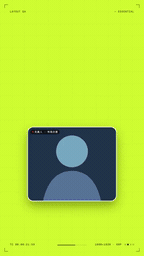

<p align="center">
  
</p>

# Adu-motion-video

**阿杜的 AI 剪辑 Skill**

阿杜实验室出品，精选由阿杜与 Opus 5.5 制作的动画动效模板。选好模板和风格，用 **Codex / Claude Code** 把你的口播与素材剪成视频，适合口播、知识讲解与方法分享。

**阿杜的模板是代码级的完整动画模板，不是提示词，也不是参考视频。** 模板包含可运行的场景源码、画面布局、动画时间轴、转场与音效编排。AI 根据你的文案和素材，选择、组合完整镜头组，交付 **MP4 与可编辑工程**；你可以继续改文字、换素材、调动画，复用同一风格制作下一期。

更多类型的模板和全助手适配持续进行中。当前平台、助手条件与模板支持范围见下方说明。

[浏览模板](#模板库)　·　[开始创作](#开始使用)　·　[下载安装包](https://github.com/adunext/adu-motion-video/releases/download/v3.14.0-rc.1/adu-motion-video_3.14.0-rc.1.zip)　·　[更新说明](https://github.com/adunext/adu-motion-video/releases/tag/v3.14.0-rc.1)

---

## 模板库

**6 类模板 · 11 种风格。** 按画面风格选择，告诉 AI 完整编号，例如 **01-B**。每套模板旁标明支持的画幅；每行最多展示 3 个风格，点击预览图或“播放示例视频”打开播放器。

### 01 · 现代图文口播

> **横屏 ✓ · 竖屏 ✓**

清爽文字、图解与真人窗口，配合节奏强调、连续形变、纵深舞台和分屏交接。适合知识讲解、工具演示、观点拆解与方法分享。

<table>
  <tr>
    <td align="center" width="256"><a href="https://adunext.github.io/adu-motion-video/examples/gallery/?template=01-A"></a><br><strong>01-A</strong><br><sub>原片节奏</sub><br><a href="https://adunext.github.io/adu-motion-video/examples/gallery/?template=01-A">▶ 播放示例视频</a></td>
    <td align="center" width="256"><a href="https://adunext.github.io/adu-motion-video/examples/gallery/?template=01-B"></a><br><strong>01-B</strong><br><sub>连续形变</sub><br><a href="https://adunext.github.io/adu-motion-video/examples/gallery/?template=01-B">▶ 播放示例视频</a></td>
    <td align="center" width="256"><a href="https://adunext.github.io/adu-motion-video/examples/gallery/?template=01-C"></a><br><strong>01-C</strong><br><sub>纵深舞台</sub><br><a href="https://adunext.github.io/adu-motion-video/examples/gallery/?template=01-C">▶ 播放示例视频</a></td>
  </tr>
  <tr>
    <td align="center" width="256"><a href="https://adunext.github.io/adu-motion-video/examples/gallery/?template=01-D"></a><br><strong>01-D</strong><br><sub>杂志分屏</sub><br><a href="https://adunext.github.io/adu-motion-video/examples/gallery/?template=01-D">▶ 播放示例视频</a></td>
    <td align="center" width="256"><a href="https://adunext.github.io/adu-motion-video/examples/gallery/?template=01-E"></a><br><strong>01-E</strong><br><sub>节拍字效</sub><br><a href="https://adunext.github.io/adu-motion-video/examples/gallery/?template=01-E">▶ 播放示例视频</a></td>
  </tr>
</table>

---

### 02 · 纸面透视讲解

> **横屏 ✓ · 竖屏 ✓**

纸张质感、透视卡片、天平与信息网络，让抽象关系变成直观图解。适合选择对比、资料整理、流程说明与行动步骤。

<table>
  <tr>
    <td align="center" width="256"><a href="https://adunext.github.io/adu-motion-video/examples/gallery/?template=02-A"></a><br><strong>02-A</strong><br><sub>纸面天平</sub><br><a href="https://adunext.github.io/adu-motion-video/examples/gallery/?template=02-A">▶ 播放示例视频</a></td>
    <td align="center" width="256"><a href="https://adunext.github.io/adu-motion-video/examples/gallery/?template=02-B"></a><br><strong>02-B</strong><br><sub>纸面聚合</sub><br><a href="https://adunext.github.io/adu-motion-video/examples/gallery/?template=02-B">▶ 播放示例视频</a></td>
  </tr>
</table>

---

### 03 · 深色 3D

> **横屏 ✓ · 竖屏 ✓**

暗色舞台、立体窗口、多屏展陈与镜头推进，突出作品细节与视觉层次。适合产品演示、软件评测、成果比较与作品集。

<table>
  <tr>
    <td align="center" width="256"><a href="https://adunext.github.io/adu-motion-video/examples/gallery/?template=03-A"></a><br><strong>03-A</strong><br><sub>多屏展陈</sub><br><a href="https://adunext.github.io/adu-motion-video/examples/gallery/?template=03-A">▶ 播放示例视频</a></td>
  </tr>
</table>

---

### 04 · 深色科技控制台

> **横屏 ✓ · 竖屏 ✓**

粒子仪器台、玻璃面板与信息流，配合输入融合、步骤展开和结果交付。适合技术讲解、自动化流程与工具实测。

<table>
  <tr>
    <td align="center" width="256"><a href="https://adunext.github.io/adu-motion-video/examples/gallery/?template=04-A"></a><br><strong>04-A</strong><br><sub>仪器台演示</sub><br><a href="https://adunext.github.io/adu-motion-video/examples/gallery/?template=04-A">▶ 播放示例视频</a></td>
  </tr>
</table>

---

### 05 · 鲜色角色叙事

> **横屏 ✓ · 竖屏 ✓**

鲜色便签、角色贴纸、物件接力与光环强调，将关键词、成果和反馈串成连贯表达。适合教程交接、方法分享、成果复用与迭代说明。

<table>
  <tr>
    <td align="center" width="256"><a href="https://adunext.github.io/adu-motion-video/examples/gallery/?template=05-A"></a><br><strong>05-A</strong><br><sub>角色与物件接力</sub><br><a href="https://adunext.github.io/adu-motion-video/examples/gallery/?template=05-A">▶ 播放示例视频</a></td>
  </tr>
</table>

---

### 06 · 活力色彩

> **竖屏 ✓ · 仅竖屏**

纸白、红、蓝与荧光黄绿，搭配大字冲击、回声标题、步骤归一和形状变化。适合观点表达、步骤讲解、要点总结与概念性成本说明。

<table>
  <tr>
    <td align="center" width="256"><a href="https://adunext.github.io/adu-motion-video/examples/gallery/?template=06-A"></a><br><strong>06-A</strong><br><sub>原生竖屏</sub><br><a href="https://adunext.github.io/adu-motion-video/examples/gallery/?template=06-A">▶ 播放示例视频</a></td>
  </tr>
</table>

预览用于了解风格，部分为局部或静音示意。部分新版模板仍为候选；各版本包含的镜头组、素材要求与发布状态见[完整模板目录](references/template-catalog.md)。

---

## 模板特点

| 特点 | 说明 |
| --- | --- |
| **代码级完整模板** | 动画源码、布局、动作时间轴和音效编排可以直接运行与编辑 |
| **按内容适配** | 根据表达关系选择完整镜头组，绑定你的文字、图片、视频和口播 |
| **保持连贯节奏** | 结合动作、转场、字幕与音效安排时间，复用同一风格制作系列内容 |
| **横竖屏按需选择** | 支持情况见每套模板标记，竖屏采用对应布局 |
| **字体不阻碍制作** | 原字体优先推荐，缺失时自动使用随包中英文字体，并检查实际排版 |
| **交付可继续修改** | 输出 MP4 与可编辑工程，后续可以改文案、换素材、再导出 |

---

## 开始使用

**平台：Windows · macOS · Linux**<br>
**助手：Codex · Claude Code · 豆包 · DeepSeek · WorkBuddy**

当前助手需要能读取素材并执行本地命令；没有 Skill 加载机制时，可让助手读取安装目录中的 `SKILL.md` 与 `AGENTS.md`。[平台与助手说明](references/compatibility.md)

| 步骤 | 操作 |
| --- | --- |
| **1 · 安装与配置** | [下载 Skill](https://github.com/adunext/adu-motion-video/releases/download/v3.14.0-rc.1/adu-motion-video_3.14.0-rc.1.zip)，解压到助手可访问的位置，让助手加载并检查制作环境 |
| **2 · 提供素材** | 上传口播视频、文案或旁白音频，也可提供素材文件夹路径；有字幕、录屏、图片和配乐就一起发 |
| **3 · 选择与制作** | 告诉助手模板编号、横竖屏和输出位置；不确定时让助手推荐，完成后检查 MP4 与可编辑工程 |

> **首次安装和配置环境可能耗时较长。** 需要准备视频工具、下载并安装依赖，耗时取决于当前环境与网络。配置完成后，后续制作可以复用环境，无需每次重新安装。

### 让 AI 引导你开始

安装并加载后，把这句话发给 AI：

```text
加载 adu-motion-video Skill，引导我开始创作。
```

AI 会告诉你先发哪些素材、如何选择模板和画幅。已有素材可以直接提供，不必一次填完所有信息。

### 已有素材，直接制作

```text
使用 adu-motion-video，选择 01-B · 连续形变，制作竖屏视频。
素材在：[我的素材文件夹路径]
请按我的文案安排动画、字幕和声音，
输出 MP4 与可编辑工程到：[我的输出目录]
```

---

## 使用资料

[完整模板目录](references/template-catalog.md)　·　[创作引导](references/start-creating.md)　·　[安装与制作工具](references/tooling.md)　·　[平台与字体兼容](references/compatibility.md)　·　[动画素材](references/lottie-assets.md)

当前下载版本为 **3.14.0-rc.1 预发布版**。更新内容与实际验证范围见[版本说明](https://github.com/adunext/adu-motion-video/releases/tag/v3.14.0-rc.1)。

阿杜实验室 · [AI 执行入口](SKILL.md) · [更新与下载](https://github.com/adunext/adu-motion-video/releases) · [MIT License](LICENSE) · [第三方说明](THIRD_PARTY.md)
