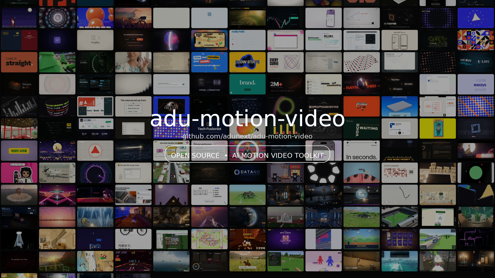
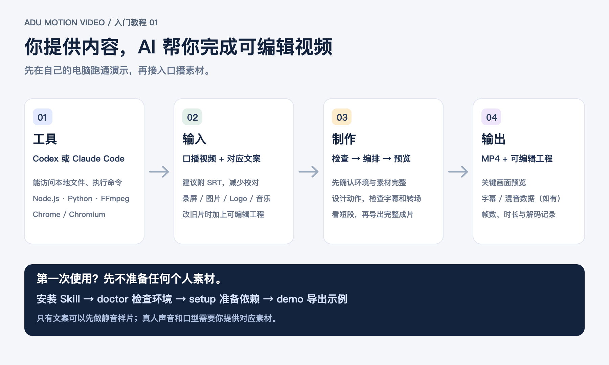

# adu-motion-video

把**新口播视频、文案和本期素材**交给能读写本地文件、运行命令的 AI Agent（如 Codex 或 Claude Code），由它选择完整动画工程中的场景，绑定新台词与素材，检查声画，再导出可编辑工程和 MP4。

**3.2.0** 的稳定范围为 A「原片节奏」三个组、B「连续形变」两个组、C「舞台镜头」/D「杂志分屏」/E「节拍字效」各三个组，以及试点外来源的纸面透视续接组，限 macOS、横屏 1080p60。五条路线的源演出与对应新内容已经作者确认；B/C/D/E 的完整新片由未参与提炼的执行者从冻结公开包和本期输入独立制作。每条路线保留自己的运动、人物与声音，通过命名语义字段绑定新内容。逐组范围与限制见[能力与验收矩阵](docs/capability-matrix.md)。B 的计划干扰组与旧候选原字节保留；旧 `anim3/anim4` 的 21 个宏场景仍为 experimental，9 个基础 `TPL` 为 quick-start。



## 先准备什么

- 一条已经剪好、长度确定的口播视频，以及对应文案；带时间码的字幕（SRT）有助于绑定动作，关键字最好有逐词时间。
- 本期要展示的录屏、图片、头像、标识、作品视频和可用配乐。公开仓库不附带原作者的真人画面或第三方作品。选用需要这些素材的场景时，必须提供替代素材。
- 期望的画幅、账号名、字幕语言和交付目录。当前完整场景包按 **1920×1080、60fps** 制作；竖屏需要另做布局，不能直接裁切。
- 本机 Node.js 18+、FFmpeg/ffprobe、Chrome，以及可运行本地命令的 Agent。当前稳定组合在 macOS / CPython 3.14.7 / 1080p60 验证，Python 包固定在 requirements-runtime.txt；其它平台、字体与 Python 组合需单独验证。

最终可得到一个可再编辑的项目目录、带音乐与音效的 MP4，以及帧数、解码和响度检查结果。画面质量仍须观看完整成片并与原工程关键动作对照；命令通过不等于视觉验收通过。

## 选择制作路线

| 路线 | 内容与用途 | 当前边界 |
| --- | --- | --- |
| [A 原片节奏](packs/classic-performance/1.0.0/README.md) | 主张与人物、真实证据聚焦、三项分解归纳 | Stable；三个组，已验收的 macOS 1080p60 |
| [B 连续形变](packs/continuous-performance/1.0.0/README.md) | 同一容器改变角色、拆解与闭合 | Stable；两个组，计划干扰组仍为 candidate |
| [C 舞台镜头](packs/stage-performance/1.0.0/README.md) | 前中后层、人物让位、实际证据与概念归纳 | Stable；三个组，完整新片与独立使用已确认 |
| [D 杂志分屏](packs/editorial-performance/1.0.0/README.md) | 版心、人物与证据分栏、跨栏交接 | Stable；三个组，本期新片按用户要求无背景配乐 |
| [E 节拍字效](packs/kinetic-performance/1.0.0/README.md) | 整词推动实体、撞击回稳、四项收拢 | Stable；三个组，完整新片与独立使用已确认 |
| [纸面透视组](packs/paper-balance/1.0.0/README.md) | 疑问、天平、用途、批注与三步确认 | Stable；一个续接组，保留约 0.37 秒的源入场 |
| [完整场景包 `anim3`](packs/anim3/README.md) | 12 个连续编辑卡片场景，保留人物、道具、数字、镜头、转场与原场景音效编舞 | 实验性；新文案与素材需逐场绑定和验收 |
| [完整场景包 `anim4`](packs/anim4/README.md) | 9 个作品展示与口播场景，保留作品墙、九宫格、软件窗口、赛道等完整编舞 | 实验性；作品墙、录屏等需要本期素材 |
| [基础 `TPL`](references/templates.md) | 9 个短场景函数，用于快速原型或从零组合较轻的片段 | Quick-start；不代表上述原工程的全部动画 |
| [手绘卡通叙事](references/handdrawn-animation.md) | 角色与道具表演、同镜头续接的方法 | 目前是制作方法和既有示例，尚未提取为完整场景包 |

`anim3`、`anim4` 是工程包 ID，不是用户视频标题或两种固定品牌风格。完整场景包可挑选、重排、重复场景，但必须尊重动作顺序、素材含义和片长。短到容不下原动作的片段会拒绝构建；多出的时间优先给可停留的画面，不会把所有动画整段慢放。作品墙需要先把至少 27 个真实独立作品制备为 389 张展示精灵，并如实保留独立作品数；不能直接拿 27 张精灵输入构建器。指定模板后，素材目录中的其他现成工程不会自动成为动画底稿。跨包逐场组合目前需要额外编排，见[来源与多包编排](references/full-project-templating.md#来源与多包编排)。详见[完整工程复用与验收](references/full-project-templating.md)。


## 用 Codex 或 Claude Code 开始

```bash
# 任选与你的 Agent 对应的位置；也可以克隆到其他路径并让 Agent 读取 SKILL.md
git clone https://github.com/adunext/adu-motion-video.git ~/.claude/skills/adu-motion-video
# Codex 可用：git clone https://github.com/adunext/adu-motion-video.git ~/.codex/skills/adu-motion-video

PL="$HOME/.claude/skills/adu-motion-video/scripts/pipeline.sh"
# 若装在 Codex 目录：PL="$HOME/.codex/skills/adu-motion-video/scripts/pipeline.sh"
bash "$PL" doctor
bash "$PL" setup
```

让 Agent 先阅读 [SKILL.md](SKILL.md)、[制作约定](references/rules.md) 和所选包说明。先发现包，选显式版本；以下以稳定的 A 包为例：

```bash
bash "$PL" packs
bash "$PL" macro-spec classic-performance@1.0.0 /已有目录/本期配置.json
# 编辑配置：挑场景、填账号及每场文案/数字/素材路径、绑定关键台词时间
bash "$PL" macro-build classic-performance@1.0.0 /已有目录/本期配置.json /已有目录/剪好口播.mp4 /已有目录/新工程
bash "$PL" stills /已有目录/新工程 0,4,12
bash "$PL" audio /已有目录/新工程
bash "$PL" mix /已有目录/新工程
bash "$PL" render /已有目录/新工程 /已有目录/新片_v1_16x9_60fps.mp4
bash "$PL" check /已有目录/新片_v1_16x9_60fps.mp4
```

以上路径只是格式示例，`macro-spec` 输出和新工程路径必须事先不存在。可传 `--subs-js /路径/新口播字幕.js` 给 `macro-build`；字幕必须与新口播对齐。`macro-spec` 列出所选包的全部组，使用前删去不需要的组，按新口播顺序排列，并补齐必填输入。配置还可指定本期音乐 `music:{mode:"track",path,offset}`，以及本期混音增益 `mix:{musicVolume:0.42}`；完成后会把实际选择、处理图和声音摘要保存为 `mix_recipe.json`，详见[声音与重现](references/audio.md)。`anim4` 和 `anim3/s06` 默认在 macOS 使用 Vision 跟踪新口播人脸，其他系统要显式提供审核过的固定裁切。构建器要求目标场景总帧数与剪好口播相符，按输出帧网格量化后必须完全一致。长短差异和动作锚点的处理见[完整工程复用与验收](references/full-project-templating.md)。

可以直接对 Agent 说：

> 使用 adu-motion-video 的完整场景包制作这条新口播。口播、SRT、文案和本期录屏在 `/实际路径/素材目录`。先运行 packs，按语义选择显式版本的完整镜头组或场景，列出所需替代素材和关键台词时间，补齐配置后生成工程；检查首帧、转场、文字裁切、口型、音乐和音效，再导出新 MP4。不要把原工程的示例文字、数字或第三方素材带进新片。

Agent 缺少 Skill 机制时，先读 [AGENTS.md](AGENTS.md)。基础模板只需运行 `bash "$PL" demo /不存在的新目录` 查看 36 秒示例；参数见[模板目录](references/templates.md)。

## 验收与扩展

至少检查第一帧有人物时人物是否可见、所有关键动作前后帧、最长文案的字体与安全区、录屏和图片裁切、场景交接、全段口型、字幕、音乐层次、音效位置及片尾。再与原工程的对应动作连续播放对照。任何一项未完成，只能标记为 experimental 或局部通过，不能宣称完整复刻验收通过。[教程：检查连续动作](assets/tutorials/03-continuity.png) · [验证记录](docs/validation.md)。

已完成的新 Opus 工程可按[持续模板接入](references/template-intake.md)登记与冻结。按新增价值区分案例、预设、变体、镜头组、路线与引擎；接收、候选和稳定发布各有证据状态。包 ID/版本和运行代码固定在新工程，后续升级不会自动改变旧片。候选提炼保留完整因果、人物、进退与声音，经过新内容及独立使用再扩大稳定库。仓库结构与贡献要求见[完整工程复用与验收](references/full-project-templating.md)。

MIT License · 第三方说明见 [THIRD_PARTY.md](THIRD_PARTY.md)。
