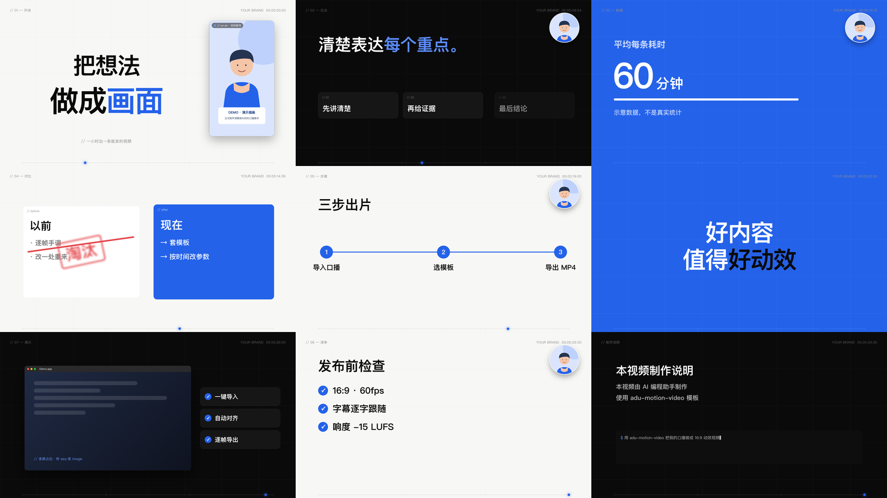

# adu-motion-video

**按阿杜的审美精选动效模板，让 AI 在 1 小时内把你的口播做成能发布的视频。**

你给口播视频和文案，AI 按字幕时间挑模板、填参数、配字幕和音乐，本地逐帧导出 1920×1080 60fps MP4。每个场景就是一行代码，改起来也快。

> 模板持续添加中。目前推荐 **Claude Code**、**Codex**；正在向下兼容 **Kimi、豆包** 等国产大模型（用 [AGENTS.md](AGENTS.md) 作入口）。

## 能做什么

| 视频类型 | 适合的模板组合 |
|---|---|
| **真人口播** | 开场标题 → 论点卡 → 数字 → 金句 → 片尾 |
| **知识讲解** | 步骤时间线 → 清单打勾 → 对比 → 数字 |
| **AI 工具 / 产品测评** | 软件窗口演示 → 功能打勾 → 以前 vs 现在 |
| **观点短评 / 新闻解读** | 大标题砸入 → 划掉盖章 → 金句高潮 |
| **课程切片 / 教程** | 步骤 → 清单 → 窗口录屏 |
| **竖屏版**（抖音 / 视频号） | 同一工程另写 `vert.html` 重排，见 [竖屏](references/portrait.md) |
| **手绘卡通叙事** | 角色与道具表演、补漏句的同镜头续接，见 [手绘](references/handdrawn-animation.md) |

另有：中英双语逐字变色字幕、代码合成的 68 种音效、配乐自动避让人声、-15 LUFS 响度、导出后自动核验帧数和完整解码。

## 模板一览



| # | 模板 | 一行调用示例 |
|---|---|---|
| 01 | 开场大标题 | `TPL.hero({t0:0, t1:4, lines:[['把想法',0], ['做成*画面*',1.2]]})` |
| 02 | 论点 + 要点卡 | `TPL.point({t0:4, t1:8, words:[['清楚表达',4.3], ['*每个重点*',4.8,'slam']], cards:[['先讲清楚',5.8]]})` |
| 03 | 数字滚动 | `TPL.number({t0:8, t1:12, label:'耗时', at:8.4, value:60, unit:'分钟'})` |
| 04 | 对比 + 盖章 | `TPL.compare({..., left:{title:'以前',items:[...]}, right:{...}, strikeAt:14, stamp:'淘汰'})` |
| 05 | 步骤时间线 | `TPL.steps({..., title:'三步出片', steps:[['导入',16.4], ['选模板',17.2]]})` |
| 06 | 金句 | `TPL.quote({t0:20, t1:23, at:20.2, lines:['好内容','值得*好动效*']})` |
| 07 | 软件演示 | `TPL.demo({..., title:'App', seq:{dir:'rec',n:300}, features:[['一键导入',23.6]]})` |
| 08 | 清单打勾 | `TPL.checklist({..., title:'发布前检查', items:[['16:9',27.4]]})` |
| 09 | 片尾制作说明 | `TPL.outro({..., lines:['本视频由 AI 制作'], prompt:'...'})` |

`*文字*` 自动变蓝；时间都是口播秒数。全部参数见 [templates.md](references/templates.md)。

## 3 步上手

**1. 安装**（macOS 已完整实测；Linux / WSL 未端到端验证）

```bash
# Claude Code
git clone https://github.com/adunext/adu-motion-video.git ~/.claude/skills/adu-motion-video
# Codex
git clone https://github.com/adunext/adu-motion-video.git ~/.agents/skills/adu-motion-video
```

需要 Node.js 18+、Python 3.10+、FFmpeg、Chrome。然后跑一次：

```bash
PL=~/.claude/skills/adu-motion-video/scripts/pipeline.sh   # Codex 换成 ~/.agents/...
bash $PL doctor && bash $PL setup
bash $PL demo ~/Desktop/adu-demo      # 36 秒演示，9 个模板各一次
```

**2. 准备素材**

```text
我的视频/
├── 口播.mp4     必需：剪好的口播
├── 文案.txt     必需
├── 字幕.srt     强烈建议（时间点从这里取）
├── 音乐.mp3     可选：有授权的配乐
└── 素材/        可选：录屏、截图、logo
```

**3. 对 AI 说**

```text
使用 adu-motion-video，把 /实际路径/我的视频 做成 16:9 60fps 动效视频。
账号名"我的账号"，要中英双语字幕，用我的音乐.mp3。
先给我看分镜表（时间 · 台词 · 模板），确认后再做，最后导出新文件。
```

## 用 Kimi、豆包等模型

这些模型没有 Skill 机制。在支持读写文件和执行命令的 Agent 工具里（如 Kimi CLI、Trae、Cursor、OpenCode 等），克隆本仓库后告诉模型：

```text
先完整阅读 <仓库路径>/AGENTS.md，按里面的流程把 /实际路径/我的视频 做成动效视频。
```

兼容性仍在测试中：模型越弱，越建议只用模板、不手写场景，并在每步完成后抽帧检查。

## 目录

```text
SKILL.md / AGENTS.md   AI 入口（内容相同）
template/              新工程起点：templates.js 模板库、scenes.js、config.js、audio.py
scripts/pipeline.sh    doctor · setup · new · import · stills · audio · mix · render · check
references/            模板参数、API、音频、字幕、竖屏、手绘、排错
examples/              历史配方源码和可独立运行的小示例
```

## 贡献模板

把模板函数加进 `template/templates.js`，在 `template/scenes.js` 演示里加一行，截图检查后提 PR。规则见 [templates.md](references/templates.md#新增模板的规则)。

MIT License · 第三方说明见 [THIRD_PARTY.md](THIRD_PARTY.md)
